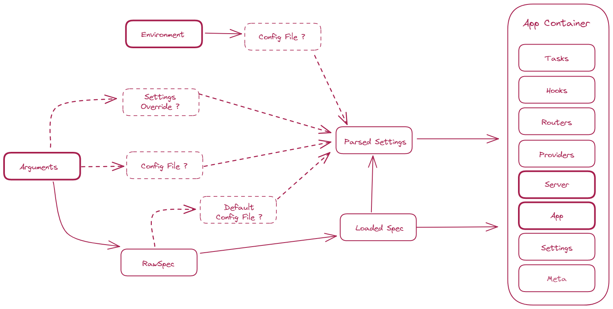
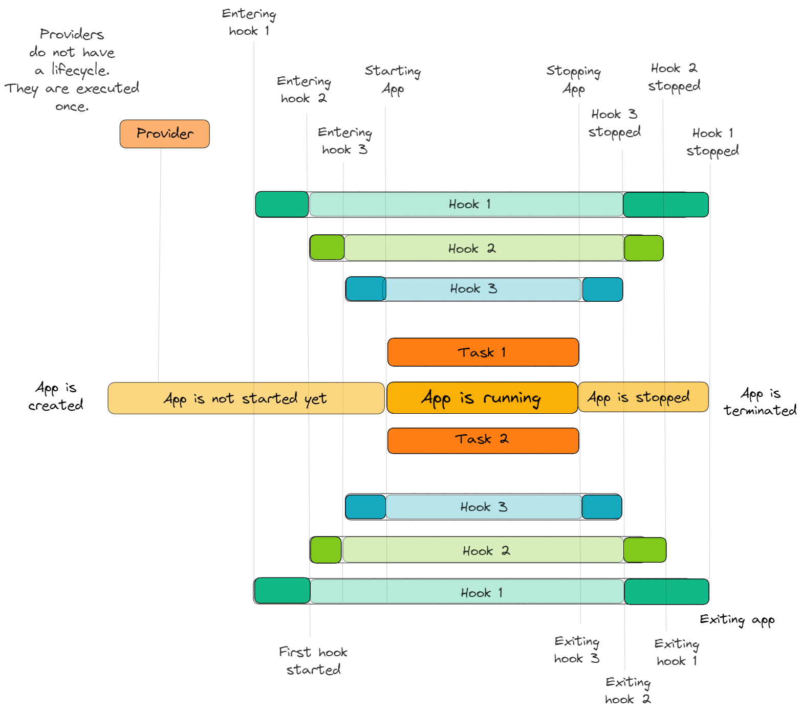

## Install

#### Install using script

```bash
python ./install.py
```

#### Install manually

The script performs the following steps:

- create a virtual environment:

```bash
python -m venv .venv
```

- update python package toolkit (within the virtual environment):

```bash
python -m pip install -U pip setuptools wheel build
```

- install the project in editable mode (within the virtual environment):

```bash
python -m pip install -e .[dev]
```

## Run the app

- Either use the `demo_app` module:

```bash
python -m wire examples/app.yaml -c examples/config.json
```

- The command line interface:

```bash
wire --help
```

- Or use `uvicorn` to start the application:

```bash
CONFIG_FILEPATH=examples/config.json uvicorn --factory demo_app.spec:container.app
```

> Note that server config won't be applied since uvicorn is started from command line and not within Python process in this case.

- It's also possible to start the application with hot-reloading:

```bash
CONFIG_FILEPATH=examples/config.json uvicorn --factory demo_app.spec:container.app --reload
```

## Configure the app

Application can be configured using environment variables or file.

> Note: Environment variables take precedence over variables declared in file. For example, assuming the above configuration is declared in a file named `config.json`, when running: `PORT=8000 CONFIG_FILE=./demo/config.json python -m demo_app`, application will listen on port `8000` and not `7777`.

> Note: When using `uvicorn`, `HOST` and `PORT` are ignored and must be specified as command line arguments if required.

## Design choices

Application is wrapped within a `Container`.

An `Container` is created from:

- _Some **settings**_: settings are defined as pydantic models. When they are not provided directly, values are parsed from environment or file.

- _Some **hooks**_: hooks are coroutine functions which can inject arbitrary resources into application state. In this application, a hook is used to add an `Issuer` instance to the application state.

- _Some **providers**_: providers are functions which can add additional features to the application. They are executed before the application is initialized, unlike hooks, which are started after application is initiliazed, but before application is started. In this application, two providers are used to optionally enable prometheus metrics and opentelemetry traces.

- _Some **routers**_: routers are objects holding a bunch of API endpoints together. Those endpoints can share a prefix and some OpenAPI metadata.



The application container factory is defined in `demo_app/spec.py`.

In order to add new capabilities to the application (routers, providers or hooks), the `AppSpec` definition should be updated.

## Objectives

- [x] **Distributable**: Application can be distributed as a python package.

- [x] **Configurable**: The database used in the application must be configurable using either a file or an environment variable.

- [x] **Configurable**: The server configuration (host, port, debug mode) must be configurable using either a file or an environment variable.

- [x] **User friendly**: A command line script should provide a quick and simply way to configure and start the application.

- [x] **Debug friendly**: Application settings should be exposed on a `/debug/settings` endpoint when application is started on debug mode.

- [x] **Observable**: Adding metrics or tracing capabilities to the application should be straighforward and transparent.

- [x] **Explicit**: Router endpoints must not use global variables but instead explicitely declare dependencies to be injected (such as database client or settings). This enables efficient sharing of resources and facilitate eventual refactoring in the future.

- [x] **Global error handling**: Error handlers are used to transforme raised exception into HTTP responses with appropriate status code. This minimize boilerplate code required to catch exceptions in every endpoint, and encourage developers to raise known exceptions in library code.

- [x] **Scalable**: Including additional routers or features in the future should require minimal work.

  - Arbitrary hooks with access to application container within their scope can be registered. Those hooks are guaranteed to be started and stopped in order, and even if an exception is encountered during a hook exit, all remaining hooks will be closed before an exception is raised. It minimize risk of resource leak within the application. Hooks can be seen as contexts just like in the illustration below:

  - Arbitrary tasks can be started along the application. Tasks are similar to hooks, and are defined using a coroutine function which takes the application container as argument and can stay alive as long as application
  is alive. Unlike hooks, tasks have a status and can be:
    - stopped
    - started
    - restarted
  It's also possible to fetch the task status to create healthcheck handlers for example.

  - Arbitrary providers with access to application container within their scope can be registered. Those providers are executed once, before the application is created. They can be used to add optional features such as tracing or metrics.
  
  - Objects provided by hooks or providers can be accessed through dependency injection in the API endpoints.

Below is an illustration of an hypothetic application lifecycle:



## Adding a hook to the application

Update the file `demo_app/spec.py` to add a new hook to your application.

> Note: It's possible to access any container attribute within hooks.

> Note: You may want to implement your router as a new module located in `hooks/` directory.

## Adding a router to the application

Update the file `demo_app/spec.py` to register a new router within your application.

> Note: You may want to implement your router as a new module located in `routes/` directory.

## Adding providers to the application

Providers are functions which can modify the FastAPI application before it is started.

They must accept an application container instance as unique argument, and should not return a value.

Example providers are located in `src/quara-wiring/quara/wiring/providers/` directory and are registered in `demo_app/spec.py`.

## Building the application

Run the following command to build the application:

```bash
python -m build .
```

### Advantages of the `src/` layout

This project uses a `src/` layout. It means that all source code can be found under `src/` directory. It might appear overkill at first, but it brings several benefits:

- Without src you get messy editable installs ("pip install -e"). Having no separation (no src dir) will force setuptools to put your project's root on `sys.path` - with all the junk in it (e.g.: setup.py and other test or configuration scripts will unwittingly become importable).

- You get import parity. The current directory is implicitly included in `sys.path`; but not so when installing & importing from site-packages.

- You will be forced to test the installed code (e.g.: by installing in a virtualenv and performing an editable install). This will ensure that the deployed code works (it's packaged correctly) - otherwise your tests will fail.

- Simpler packaging code and manifest. It makes manifests very simple to write (e.g.: root directory of project is never considered by setuptools or other packaging toolswhen bundling files into package). Also, zero fuss for large libraries that have multiple packages. Clear separation of code being packaged and code doing the packaging.

### Telemetry

- [`BatchSpanProcessor`](https://opentelemetry-python.readthedocs.io/en/latest/sdk/trace.export.html#opentelemetry.sdk.trace.export.BatchSpanProcessor) is configurable with the following environment variables which correspond to constructor parameters:

- [OTEL_BSP_SCHEDULE_DELAY](https://opentelemetry-python.readthedocs.io/en/latest/sdk/environment_variables.html#envvar-OTEL_BSP_SCHEDULE_DELAY)
- [OTEL_BSP_MAX_QUEUE_SIZE](https://opentelemetry-python.readthedocs.io/en/latest/sdk/environment_variables.html#envvar-OTEL_BSP_MAX_QUEUE_SIZE)
- [OTEL_BSP_MAX_EXPORT_BATCH_SIZE](https://opentelemetry-python.readthedocs.io/en/latest/sdk/environment_variables.html#envvar-OTEL_BSP_MAX_EXPORT_BATCH_SIZE)
- [OTEL_BSP_EXPORT_TIMEOUT](https://opentelemetry-python.readthedocs.io/en/latest/sdk/environment_variables.html#envvar-OTEL_BSP_EXPORT_TIMEOUT)
